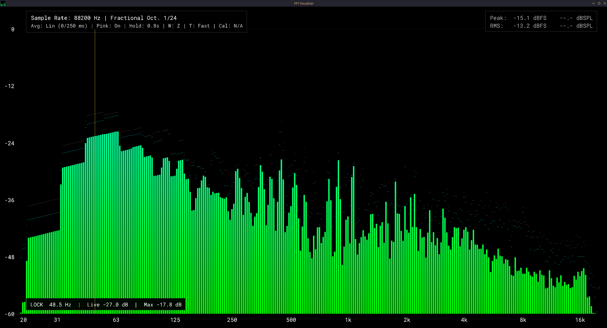

# C FFT Visualizer

Visualize the Fast Fourier Transform (FFT) of audio signals in real-time using C, FFTW3, Raylib and PortAudio. Includes RTA-style smoothing, per-band peak-hold, and pink-noise compensation.

> [!WARNING]
> Early prototype.
> Only supports .wav audio files for now or Live microphone.
> Sample rates of 48kHz and higher may make the visualization lag relative to the audio.

## Requirements
- C Compiler
- [Raylib](https://www.raylib.com/)
- [FFTW3](http://www.fftw.org/)

Arch Linux:
```bash
sudo pacman -S clang raylib fftw portaudio
```

## Build and run
```bash
chmod +x build.sh
./build.sh

# Audio file
./build/c_fft_visualizer <path_to_audio_file> <--loop (optional)>

# Live microphone
./build/c_fft_visualizer --mic
```

## Features
- Log-frequency bars with fractional-octave smoothing (1/1…1/48)
- dB-domain time averaging (EMA) with Fast/Slow presets
- Frequency weighting modes (Z/A/C)
- SPL calibration workflow (94 dB calibrator via key command)
- Per-band peak-hold with timed decay
- Persistent max-hold trace (manual clear)
- Peak-find + nearest-band lock navigation
- Pink compensation (pink-flat display)
- dB grid overlay and peak/RMS meters
- Cursor readout (hover for exact Hz and level)
- Use a live microphone with the flag: --mic

## Controls
- O: Change octave scaling (1/1…1/48)
- C: Cycle color gradients
- P: Toggle pink compensation
- A: Toggle dB-domain averaging (v.s. linear)
- F: Toggle Fast/Slow averaging preset
- H: Cycle peak-hold (Off, 0.5s, 1.0s, 2.0s)
- W: Cycle frequency weighting (Z/A/C)
- T: Cycle meter time weighting (Fast/Slow/Impulse)
- K: Calibrate SPL to 94 dB reference (mic mode only)
- G: Peak-find from max-hold trace and lock cursor
- Left/Right: Step locked band by one bar
- Mouse Left: Toggle nearest-band lock
- R: Reset peak and max-hold traces
- Space: Freeze/Unfreeze live trace
- F11: Toggle fullscreen

## Configuration
Edit include/config.h to tune defaults

- Default FFT settings are `FFT_WINDOW_SIZE=8192`, `FFT_HOP_SIZE=FFT_WINDOW_SIZE/16` for a professional RTA-style balance of low-end detail and low display latency.
- Increase `FFT_WINDOW_SIZE` if you want even finer bass resolution, or decrease it for the fastest transient tracking.
- Increase or decrease `UI_SCALE` to resize on-screen text/panels globally if the UI looks too small or too large on your display.

## Screenshot


## License
GPL-3.0 License